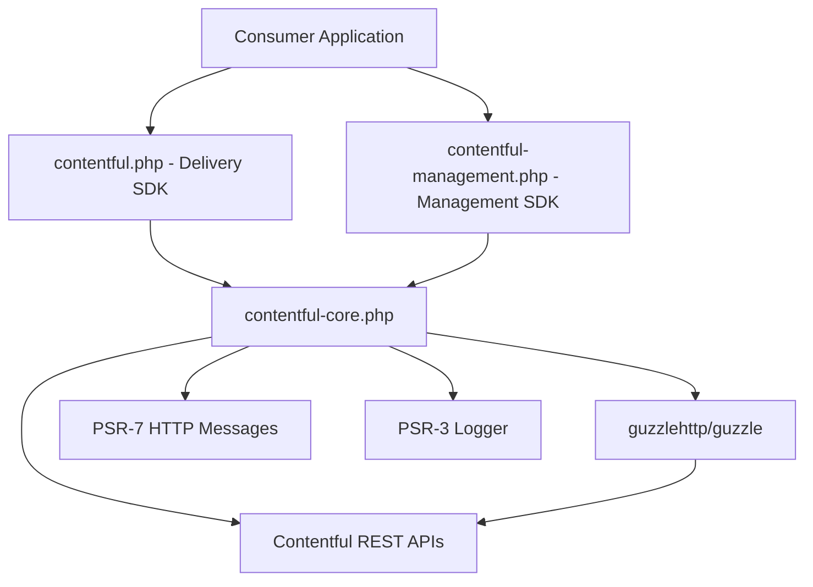

# Architecture

<!-- Generated by seed-golden-context | Last updated: 2026-05-11 -->

## Overview

`contentful-core.php` is the shared foundation library for all Contentful PHP SDKs. It provides the HTTP client abstraction, request/response lifecycle, resource modeling primitives, file handling, and error types that both the [Delivery SDK (`contentful.php`)](https://github.com/contentful/contentful.php) and the [Management SDK (`contentful-management.php`)](https://github.com/contentful/contentful-management.php) build on top of. It is not intended for direct use by third-party packages.

## System Context

## Internal Structure

| Directory | Purpose |
|---|---|
| `src/Api/` | HTTP client layer — `BaseClient`, `Requester`, `RequestBuilder`, `UserAgentGenerator`, `Message`, `Link`, `BaseQuery`, `DateTimeImmutable`, and supporting interfaces |
| `src/Exception/` | Typed API error classes (`AccessTokenInvalidException`, `BadRequestException`, `InvalidQueryException`, `NotFoundException`, `RateLimitExceededException`, etc.) |
| `src/File/` | File/asset modeling — `File`, `ImageFile`, `ImageOptions`, upload variants (`LocalUploadFile`, `RemoteUploadFile`), and URL options interface |
| `src/Log/` | `NullLogger` — a PSR-3 no-op logger used as the default when no logger is injected |
| `src/Resource/` | Resource primitives — `ResourceInterface`, `ResourceArray`, `ArraySystemProperties`, resource pool (`BaseResourcePool`, `ResourcePoolInterface`), and content type/entry/asset interfaces |
| `src/ResourceBuilder/` | Object hydration layer — `BaseResourceBuilder`, `MapperInterface`, `ObjectHydrator`, and `ResourceBuilderInterface` |
| `tests/` | Unit tests (PHPUnit), fixture JSON, and concrete test implementations under `tests/Implementation/` |
| `scripts/` | Release helper script (`release.php`) |

## Data Flow

API requests flow through a single pipeline:

1. **`BaseClient::callApi()`** — the entry point for all SDK API calls. Accepts method, URI path, and options.
2. **`RequestBuilder::build()`** — constructs a PSR-7 `Request` with the correct URI, Bearer token, `Authorization` header, `X-Contentful-User-Agent` header, and `Accept` / `Content-Type`.
3. **`Requester::sendRequest()`** — dispatches through Guzzle, captures timing, and wraps any `ClientException` into a typed `Exception` subclass based on the `sys.id` field in the error response body.
4. **`BaseClient`** — logs the `Message` (at INFO + DEBUG levels) via PSR-3, optionally stores it in `$messages`, and throws if an exception was produced.
5. **Response JSON** — parsed back to a PHP array by `BaseClient::parseResponse()` and returned to the concrete SDK client.

Resource hydration is a separate concern handled by `BaseResourceBuilder`. It receives the raw array, dispatches to the appropriate `MapperInterface` implementation via `getSystemType()`, and returns a typed `ResourceInterface` object. Concrete SDK implementations extend `BaseResourceBuilder` and provide their own mapper namespaces and system-type resolution.

## Key Dependencies

| Dependency | Why it's here |
|---|---|
| `guzzlehttp/guzzle` ^6.5\|^7.0 | HTTP client; provides PSR-7 request construction and transport. See [ADR-0002](./docs/ADRs/0002-guzzle-as-http-client.md). |
| `guzzlehttp/psr7` ^1.6\|^2.1.1 | PSR-7 URI/request/response implementations used by `RequestBuilder` |
| `psr/http-message` ^1.0\|^2.0 | Interoperability contract; consumers can substitute any PSR-7-compatible client |
| `psr/log` ^1.1\|^2.0\|^3.0 | Logging contract; callers inject any PSR-3 logger. See [ADR-0003](./docs/ADRs/0003-psr-interfaces.md). |
| `jean85/pretty-package-versions` ^1.5\|^2.0 | Reads installed Composer package versions at runtime for `X-Contentful-User-Agent` header construction |

## Configuration

This is a library — there are no environment variables or runtime configuration flags. Behavior is controlled entirely through constructor arguments on `BaseClient`:

| Constructor Argument | Purpose | Default |
|---|---|---|
| `$accessToken` | Bearer token sent on every request | Required |
| `$host` | Base URI for API calls | Required |
| `$logger` | PSR-3 logger for request logging | `NullLogger` (no-op) |
| `$httpClient` | Guzzle HTTP client instance | `new HttpClient()` |
| `$storeMessages` | Whether to accumulate `Message` objects for inspection | `true` |

## Integration Points

### Upstream (this repo consumes)

- **Contentful REST APIs** — CDA (`cdn.contentful.com`) and CMA (`api.contentful.com`); called via Guzzle
- **Packagist** — library distribution; releases trigger a webhook sync

### Downstream (consumes this repo)

- **[contentful.php](https://github.com/contentful/contentful.php)** — Delivery SDK; extends `BaseClient`, `BaseResourceBuilder`, `BaseQuery`, all resource interfaces
- **[contentful-management.php](https://github.com/contentful/contentful-management.php)** — Management SDK; same extension pattern
- **[ContentfulBundle](https://github.com/contentful/ContentfulBundle)** — Symfony integration; depends on `contentful.php` and transitively on this library
- **[contentful-laravel](https://github.com/contentful/contentful-laravel)** — Laravel integration; same transitive dependency

## Versioning

Follows [Semantic Versioning](https://semver.org/). Dropping support for a PHP version is a **breaking change** and requires a major version bump. Current stable: **4.x** (PHP 8.0+ only). See [ADR-0004](./docs/ADRs/0004-semver-and-bc-policy.md).
